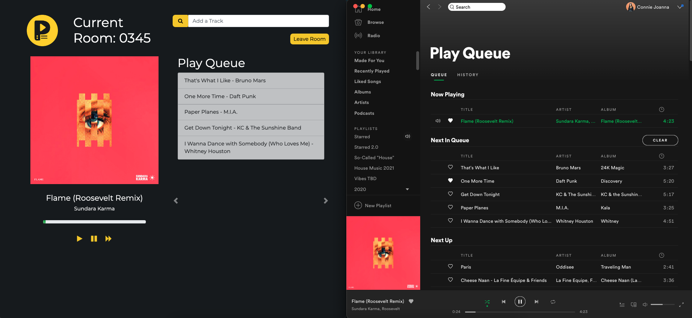

# Unwind

## Description

**Unwind** is an app for live, group music listening on Spotify. 
Build a queue of songs with friends, listen to the queue of tracks together, and control the music for the entire room - all in real-time.

Unwind is built with React, socket.io, Node, Express and MongoDB to give users the real-time ability to add tracks to a shared queue and the ability to play, pause, & skip to the next track.

After signing in with your Spotify Premium account, you can create a room to listen to music with friends. Then queue up one of your Spotify playlists or search Spotify to add new tracks for the entire room. 

Once your friends join, everyone can add tracks to a shared queue and listen to the same songs. You and your friends can play the song, pause the song, or skip to the next song for everyone in the room - all in real-time.

    
  </a>

## Technologies

Unwind was built using the following technologies:

* [ReactJS](https://reactjs.org/) - Front-end framework
* [socket.io](https://socket.io/) - Real-time events communication 
* [NodeJS](https://nodejs.org/en/) - Javascript runtime environment for the application
* [Express](https://expressjs.com/) - Middleware for routing HTTP requests
* [MongoDB](https://www.mongodb.com/) Atlas / Mongoose - Backend database
* [Spotify API](https://developer.spotify.com/) - Music listening & playback control
